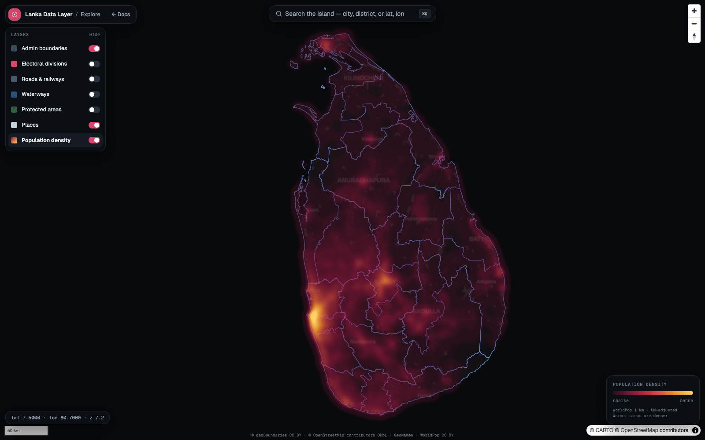
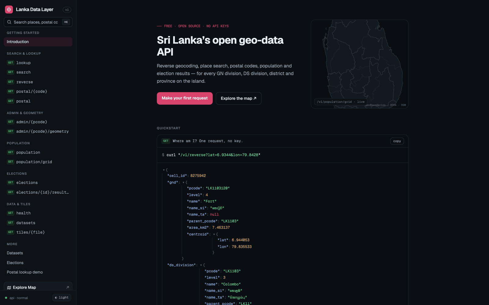
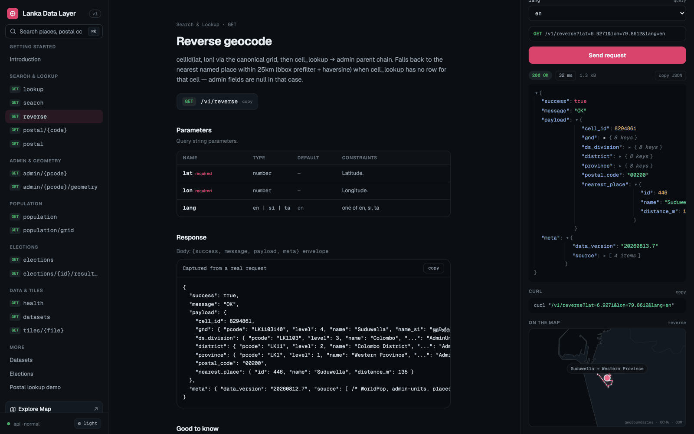
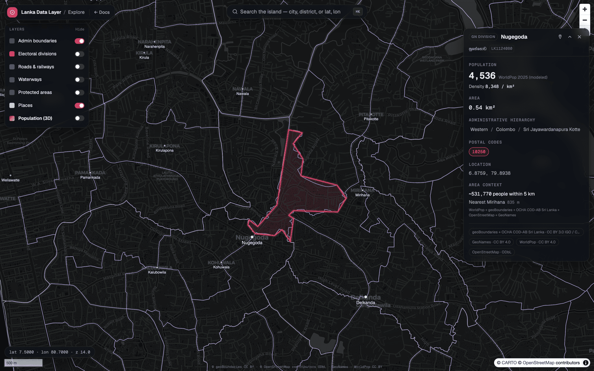

# Lanka Data Layer

**Sri Lanka's open geo-data API** — reverse geocoding, universal search, postal codes, population, and election results for every GN division, DS division, district, and province on the island, plus a map platform built on top of it. Free, open source, no API keys.

<p align="center">
  
</p>

All spatial computation happens offline, ahead of time, so the API itself is just a fast, cacheable read — reverse geocoding is one indexed SQLite lookup, not a live point-in-polygon query.

## Why

Sri Lankan geographic and statistical data is scattered across census PDFs, government portals, OSM extracts, and one-off datasets. Developers who need "which district is this coordinate in?" or "population of this DS division by age" end up either paying for global APIs that know little about Sri Lanka below district level, or hand-rolling their own extracts.

Lanka Data Layer fixes this with one principle: **Sri Lanka's data is small enough to precompute everything.** The entire country is on the order of ~70K populated 1 km grid cells, ~30K named places, 330 DS divisions, and ~14K GN divisions — small enough to fit in a single SQLite file. So instead of running expensive spatial queries per request, a data pipeline (`foundry`) does all the spatial work offline, once, and the API serves precomputed lookups.

## Feature tour

### Interactive API docs

The docs home doubles as the landing page — a live minimap (`/v1/population/grid`, updating in real time), a one-request quickstart, and the full endpoint reference in the sidebar.

<p align="center">
  
</p>

Every endpoint page has a live "Try it" panel: real request parameters, a **Send request** button that calls the actual API (not a mock), a syntax-colored JSON response, a copyable curl line, and — for endpoints with a location — a response-driven minimap. The docs and endpoint reference panes are resizable (drag the divider, double-click to reset).

<p align="center">
  
</p>

### Explore map

The map explorer resolves any search into a highlighted boundary or point and a detail card. The card's core fields (population, area, admin hierarchy, postal codes) render immediately from one request; secondary sections (nearby-population context, source attribution) load progressively as each upstream source responds, each carrying its own attribution rather than one blended credit line. The highlight stays pinned to the map while the card loads, and the card itself can be pinned open while you keep browsing.

<p align="center">
  
</p>

Toggle **Population (3D)** in the layer panel and the camera tilts into a column view of WorldPop's gridded density — the hero image at the top of this README is that layer over the island's southwest.

### Universal search

One omnibox, four query shapes: a place or division name, a 5-digit postal code, a coordinate pair (`6.9344, 79.8428`, with or without a `° N/E` decoration), or an OCHA p-code (`LK1103`). `GET /v1/lookup` classifies the query and dispatches to the right lookup internally — `?suggest=1` returns lightweight typeahead rows (grouped by type, sublabel resolved from the containing admin unit) for exactly the dropdown you see in the map explorer's search bar.

## Run it yourself

**Prerequisites**

- Node ≥ 22
- pnpm (this repo pins `pnpm@10.0.0` via `packageManager` — `corepack enable` will pick that up)
- [tippecanoe](https://github.com/felt/tippecanoe) on `PATH`, for the foundry's vector-tile step (`brew install tippecanoe` on macOS; built against v2.79.0)
- Docker — optional, only needed to run the API from its container instead of `tsx`

**Clone and install**

```bash
git clone https://github.com/prabhavalabs/lanka-data-layer.git
cd lanka-data-layer
pnpm install
```

**Build the data**

The foundry is an offline ETL pipeline: it fetches or reads every source, normalizes it into the canonical p-code-keyed schema, and emits `foundry/data/artifacts/lanka.sqlite` + `manifest.json`. Nothing else runs without that file.

```bash
FOUNDRY_SEED_SOURCE=/path/to/ceylon-hub pnpm foundry run build
```

Honestly: the `seed` step still copies a handful of source files — geoBoundaries-derived admin levels 0-2, POIs, election results, roads/waterways/protected areas — from a local clone of the predecessor project, [`prabhavalabs/ceylon-hub`](https://github.com/prabhavalabs/ceylon-hub); `FOUNDRY_SEED_SOURCE` must point at that checkout the first time you build. Everything else — the GeoNames postal-code dump, the WorldPop population raster, OCHA COD-AB's admin boundaries — is fetched live over the network. Once `foundry/data/raw/` is populated, `FOUNDRY_SEED_SOURCE` isn't needed again; re-running `build` only fetches what's still missing, so it's cheap and safe to repeat.

A full build takes roughly 3 minutes end to end (dominated by the WorldPop raster download and the tiles step). To rebuild a single step instead:

```bash
pnpm foundry run build --only admin,population
```

See [`foundry/README.md`](foundry/README.md) for the full pipeline (every step, `--only` filtering, what each one produces).

**Run the API**

```bash
pnpm api run dev      # tsx watch, reloads on change — http://localhost:8600
```

Reads `foundry/data/artifacts/lanka.sqlite` by default (override with `LANKA_DB`). See [`api/README.md`](api/README.md) for the full environment variable table, endpoint reference, and Docker instructions.

**Run the web app**

```bash
pnpm web run dev      # Vite — http://localhost:5173
```

The dev server proxies `/v1` to `http://localhost:8600`, so it only needs the API running alongside it — no separate config. Interactive API docs live at `/`, the endpoint reference at `/docs/:slug` (e.g. `/docs/reverse`), and the map explorer at `/map`.

## API at a glance

```
GET /v1/lookup?q=nugegoda&suggest=1      # universal search: names, postal codes,
GET /v1/lookup?q=6.9344,79.8428          # coordinates, and p-codes in one box
GET /v1/reverse?lat=6.9271&lon=79.8612   # point → GN/DS/district/province + postal
GET /v1/search?q=nugegoda&lang=si
GET /v1/postal/10250
GET /v1/postal?lat=6.9271&lon=79.8612
GET /v1/admin/LK1103?include=population,stats   # postal_codes serving the unit come free
GET /v1/admin/LK1103/geometry            # boundary GeoJSON for map highlights
GET /v1/population?lat=6.9271&lon=79.8612&radius=5
GET /v1/population/grid?res=0.02         # density buckets for 3D map rendering
GET /v1/elections/pres-2024/results/EC-01
GET /v1/datasets
GET /v1/tiles/admin.pmtiles              # vector tiles, range requests
```

All endpoints return `{ success, message, payload, meta }`, where `meta` carries the data version and source attribution. Interactive documentation with a live playground for every endpoint ships in the web app under `/`, including a postal-code demo that answers and maps a query in one view.

## What's in the box

| Package | Name | Purpose |
|---|---|---|
| [`foundry/`](foundry/) | `@lanka-data-layer/foundry` | Offline ETL pipeline: fetches every source, normalizes into a canonical p-code-keyed schema, emits build artifacts (SQLite database, lookup tables, vector tiles, downloads) |
| [`api/`](api/) | `@lanka-data-layer/api` | The Lanka Data Layer API: HTTP service serving the foundry's artifacts |
| [`web/`](web/) | `@lanka-data-layer/web` | Visualization platform: maps, charts, dashboards — the API's first consumer |
| [`shared/`](shared/) | `@lanka-data-layer/shared` | Shared TypeScript types: API contracts, p-code and grid conventions |
| `infra/` | — | Docker Compose, reverse-proxy config, deployment scripts (planned — see Roadmap) |
| [`docs/`](docs/) | — | Architecture, data contract, source catalog |

Package-level documentation: [`foundry/README.md`](foundry/README.md) covers the ETL pipeline and how to add a new source; [`api/README.md`](api/README.md) covers endpoints, environment variables, and Docker.

## Data sources & credits

Everything this project serves originates from open data. This table is the honest, current list of what we use and under what terms. It's kept in sync with the dataset catalog served at `GET /v1/datasets` and the machine-readable source list in every build's `manifest.json` (see [Transparency & data lineage](#transparency--data-lineage) below).

| Source | What we use | License |
|---|---|---|
| [geoBoundaries](https://www.geoboundaries.org) | Administrative boundaries: country, 9 provinces, 25 districts (ADM0-ADM2) | [CC BY 3.0 IGO](https://creativecommons.org/licenses/by/3.0/igo/) |
| [OCHA / HDX — cod-ab-lka](https://data.humdata.org/dataset/cod-ab-lka) | DS divisions (339, ADM3) and GN divisions (~14,000, ADM4) with official p-codes | CC BY-IGO |
| [OCHA / HDX — cod-ps-lka](https://data.humdata.org/dataset/cod-ps-lka) | Population projections by admin unit, age bucket, and sex | CC BY-IGO |
| [OpenStreetMap](https://www.openstreetmap.org) contributors, via the Overpass API | Places, points of interest — hospitals, schools, stations, airports | [ODbL](https://opendatacommons.org/licenses/odbl/1-0/) — share-alike, see note below |
| [GeoNames](https://www.geonames.org) | Sri Lanka postal-code dump today; the place-name gazetteer with Sinhala and Tamil alternates is planned | [CC BY 4.0](https://creativecommons.org/licenses/by/4.0/) |
| Survey Department of Sri Lanka, via [nuuuwan/sl-topojson](https://github.com/nuuuwan/sl-topojson) | Electoral district and polling division boundaries | Open |
| Election Commission of Sri Lanka, via [nuuuwan/lk_elections](https://github.com/nuuuwan/lk_elections) | Presidential and parliamentary election results, 2015–2024 | Open |
| [Department of Census and Statistics](http://www.statistics.gov.lk) | 2012 census (ethnicity, religion); [2024 Census of Population and Housing](http://www.statistics.gov.lk/Population/StaticalInformation/CPH2024) final report, DS-division tables A5–A7 (population by sex and age group, ethnicity, religion) | 2012: Open; 2024: not stated — no license terms on the source pages (see note below) |
| [WorldPop](https://www.worldpop.org) | ~1 km UN-adjusted gridded population (2025), distributed onto the canonical grid | [CC BY 4.0](https://creativecommons.org/licenses/by/4.0/) |

**A note on OpenStreetMap and ODbL.** OSM data is licensed under the Open Database License, which is share-alike: if you produce and redistribute a derivative database built from the OSM-sourced tables in this project (places, points of interest, and related layers), that derivative must also be released under ODbL, with attribution to OpenStreetMap contributors preserved. Querying the data through the API, or displaying it on a map, doesn't by itself trigger that obligation — redistributing the underlying data does. See the [ODbL summary](https://opendatacommons.org/licenses/odbl/1-0/) if you're unsure.

**Acknowledgements.** This project leans heavily on two communities in particular. The **OpenStreetMap Sri Lanka** contributor community has spent years mapping the country's places, roads, and infrastructure by hand — that patient, ongoing work is the backbone of our places and points-of-interest data. And the open-data projects maintained by **[nuuuwan](https://github.com/nuuuwan)** — [`sl-topojson`](https://github.com/nuuuwan/sl-topojson) and [`lk_elections`](https://github.com/nuuuwan/lk_elections) — did the hard, thankless work of turning Sri Lankan electoral geometry and Election Commission results into clean, usable open data. Without that curation, sourcing this project's electoral boundaries and results directly would have been far harder. Thank you.

## Transparency & data lineage

Every foundry build emits a `manifest.json` alongside the SQLite artifact, recording `data_version`, the fetch date of each upstream source, and a SHA-256 checksum for every artifact produced. Every API response also carries attribution: `meta.source` and `meta.data_version` travel with every payload that touches a dataset, and the full catalog — source, license, feature count — is queryable at `GET /v1/datasets`.

### Known limitations

We'd rather be upfront about the rough edges than hide them:

- **Admin-unit counts differ between sources.** COD-AB reports 339 DS divisions where other sources say 330-331; we serve COD-AB as published. Levels 0-2 geometry comes from geoBoundaries while levels 3-4 come from COD-AB, so boundaries can disagree slightly where the two sources differ.
- **2012 religion figures are rounded in the source.** The Department of Census and Statistics' 2012 ethnicity/religion tables are reproduced as published, rounding included.
- **The 2024 census carries no stated license.** The Department of Census and Statistics publishes the 2024 Census of Population and Housing tables without explicit license terms on the source pages. We reproduce them as a public government statistical publication, with full attribution; if the department publishes terms, we'll follow them.
- **2024 census DS-division rows are matched by name, not by p-code.** The census tables identify DS divisions by name only, so the foundry joins them to COD-AB ADM3 p-codes by normalized name within each district, with a hand-verified alias table for spelling variants (e.g. Mathugama/Matugama, Vadamaradchy/Vadamaradchchi). One census row — Kalmunai North Sub (Ampara) — has no COD-AB counterpart and is skipped; its population is still counted in the Ampara district and national rows. Census age groups are coarse (&lt;15, 15–59, 60–64, 65+) and the published tables carry no sex-by-age cross-tabulation.
- **Gridded population is a model, not a count.** The cells table distributes WorldPop's ~1 km modeled estimates uniformly across the fine grid cells each raster pixel covers — good for density visualization and radius sums, but not a source of truth for any individual 111 m cell.
- **Postal-code areas are derived, not official.** Sri Lanka publishes no postal-code boundary data, so per-division codes are computed: each code's district comes from the GeoNames dump's district labels, its point is re-geocoded to the same-named administrative division where one exists (GeoNames' own postal coordinates are frequently inaccurate), and coverage areas come from nearest-code assignment within each district. Good for lookup and display; not an authoritative delivery-zone map.
- **Postal-vote election entities have derived names.** The Election Commission's result files for the postal-vote entities carry vote totals but no display name, so the foundry constructs one from the sourced electoral district name — it won't match a name that appears verbatim in the source.

If something you're building depends on any of the above, check `GET /v1/datasets` and the build's `manifest.json` for current status before relying on it.

## Architecture

All spatial work happens offline. The foundry precomputes a fine grid over Sri Lanka mapping every cell to its GN division, DS division, district, province, postal code, and nearest city; at request time, reverse geocoding is one indexed lookup, not a point-in-polygon query. The API ships with a read-only SQLite file the foundry builds — data updates are a file swap, not a migration — and never writes to it; `foundry` never imports `api` or `web`. Every admin unit is keyed by its OCHA p-code (`LK1` … `LK1103` …), the stable join key across every table. Geometry is served as vector tiles (PMTiles, HTTP range requests), never as multi-megabyte GeoJSON payloads, and responses are cached aggressively (`ETag` + long `Cache-Control`) since they're immutable per data release.

The full binding contract — canonical grid formula, SQLite schema, artifact manifest, API envelope — lives in [`docs/architecture.md`](docs/architecture.md). Read it before touching any package; changes to it are breaking and need a `data_version` bump.

## Development

- **Branches**: work happens on `feat/*` / `fix/*` branches off `develop`; `main` is production.
- **Commits**: `type: brief description` — `feat`, `fix`, `refactor`, `test`, `docs`, `chore`.
- **Monorepo**: pnpm workspaces; run any package's scripts via `pnpm --filter @lanka-data-layer/<pkg> run <script>`.

## Roadmap

- **Phase 0 — Data foundry** — done: source fetchers, canonical schema, SQLite + lookup + tile artifacts.
- **Phase 1 — Lanka Data Layer API** — done: reverse geocode, universal lookup, search, postal, admin, population, elections, datasets.
- **Phase 2 — Platform** — done: interactive API docs with a live try panel, map explorer with vector tiles and progressive detail cards, 3D population layer.
- **Phase 3 — Community**, in progress:
  - VPS deployment and production infrastructure
  - Census 2024 ingestion
  - Sinhala/Tamil search names (the GeoNames gazetteer integration)
  - Benchmark suite
  - Economy module

## Contributing

Issues and pull requests are welcome. Please open PRs against `develop`, not `main`, and follow the branch and commit conventions above (`feat/*` / `fix/*`, commit messages as `type: brief description`).

Data corrections are especially welcome — Sri Lankan open data is scattered and occasionally wrong. If you spot an error (a misplaced boundary, a stale figure, an incorrect Sinhala or Tamil name), please open an issue with a citation to the correct source so it can be verified and fixed at the foundry level.

## License

Code in this repository is MIT-licensed — see [LICENSE](LICENSE).

Data remains under each upstream source's own license, as listed in [Data sources & credits](#data-sources--credits) above and in each dataset's `license` field at `GET /v1/datasets`. Tables derived from OpenStreetMap (places, points of interest, and related layers) carry ODbL's share-alike terms. Whatever you build with this project's data, please preserve attribution to the original source.
